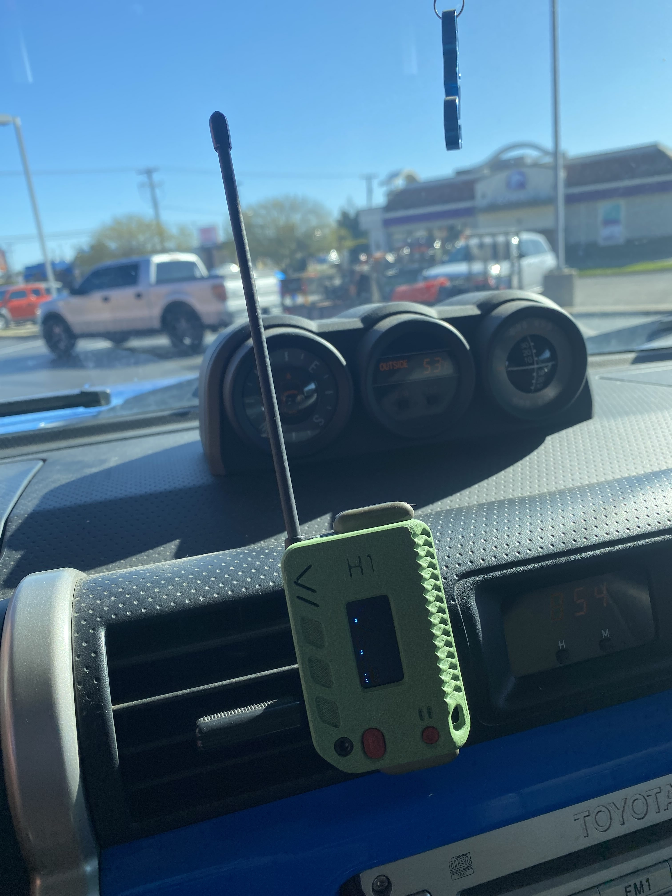

---
tags:
  - Info
  - Getting Started
  - Meshtastic
  - MeshCore
hide:
  - navigation
---

# About

## What is Missouri Mesh?

We are a community of LoRa enuthesiates working together to create an off-grid, decentralized, and resilient communications network. Operating within the unlicensed 915 MHz ISM band, these devices are typically loaded with either MeshCore or Meshtastic firmware, enabling users to communicate without using traditional networks.

<!-- copied from chimesh -->
<figure markdown="span">
  { width=500 }
  <figcaption></figcaption>
</figure>

## What is MeshCore and Meshtastic?

[MeshCore](https://meshcore.io) and [Meshtastic](https://meshtastic.org) are projects aimed at encrypted text communication over LoRa radios in a decentralized nature. Check out their websites for more info.

## Getting Started

1. Join [our Discord](https://missourimesh.org/discord)
2. Purchase [supported hardware](https://www.rfindex.com/mesh/devices) and [antenna](https://www.rfindex.com/mesh/antennas)
3. Flash your hardware with the [MeshCore](https://flasher.meshcore.dev) or [Meshtastic](https://flasher.meshtastic.org) firmware
4. Download the corresponding app for your firmware, then connect to your node (MeshCore: [iOS](https://apps.apple.com/us/app/meshcore/id6742354151) or [Android](https://play.google.com/store/apps/details?id=com.liamcottle.meshcore.android); Meshtastic: [iOS](https://apps.apple.com/us/app/meshtastic/id1586432531) or [Android](https://play.google.com/store/apps/details?id=com.geeksville.mesh)).
