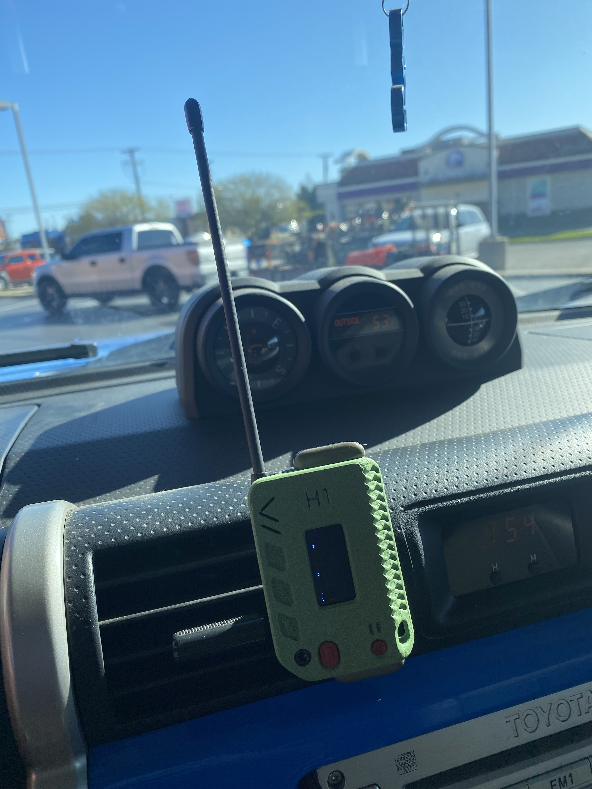

---
tags:
  - Info
  - Getting Started
  - Meshtastic
  - MeshCore
hide:
  - navigation
---

# About

## What is Missouri Mesh?

We're a community of LoRa enthusiasts building an off-grid, decentralized, and resilient communications network across Missouri. Running on the unlicensed 915 MHz ISM band, our devices use either MeshCore or Meshtastic firmware, letting anyone send messages without relying on cell towers or the internet.

<!-- copied from chimesh -->
<figure markdown="span">
  { width=500 }
  <figcaption></figcaption>
</figure>

## What is MeshCore and Meshtastic?

[MeshCore](https://meshcore.io) and [Meshtastic](https://meshtastic.org) are both open projects for encrypted, decentralized text communication over LoRa radios. Visit their websites to learn more about how each one works.

## Getting Started

1. Join [our Discord](https://missourimesh.org/discord)
2. Purchase [supported hardware](https://www.rfindex.com/mesh/devices) and [an antenna](https://www.rfindex.com/mesh/antennas)
3. Flash your hardware with [MeshCore](https://flasher.meshcore.dev) or [Meshtastic](https://flasher.meshtastic.org) firmware
4. Install the matching app and connect to your node — MeshCore: [iOS](https://apps.apple.com/us/app/meshcore/id6742354151) · [Android](https://play.google.com/store/apps/details?id=com.liamcottle.meshcore.android); Meshtastic: [iOS](https://apps.apple.com/us/app/meshtastic/id1586432531) · [Android](https://play.google.com/store/apps/details?id=com.geeksville.mesh)

