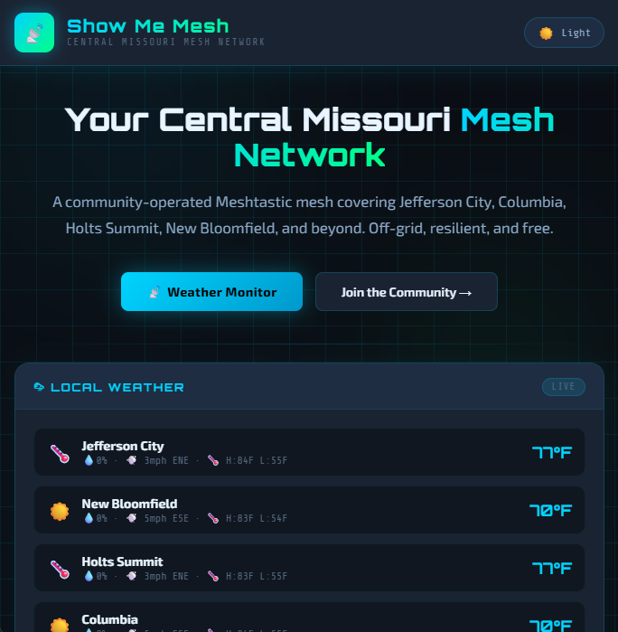

---
hide:
  - toc
  - navigation
tags:
  - Info
---

# Check Out Our Neighbors

-   [__Saint Louis Mesh__](https://meshstl.org/)
    

-   [__Chicagoland Mesh__](https://chimesh.org/)
    

-   [__Iowa Mesh__](https://iowamesh.org/)
    

-   [__Northwest Arkansas Mesh__](https://nwame.sh/)
    

-   [__Central Arkansas Mesh__](https://lrme.sh/)
    

-   [__Tennessee Mesh__](https://tennmesh.com/)
    

-   [__Nebraska Mesh__](https://www.nebraskamesh.net/)
    

-   [__Show Me Mesh__](https://mo-mesh.com/)
    

